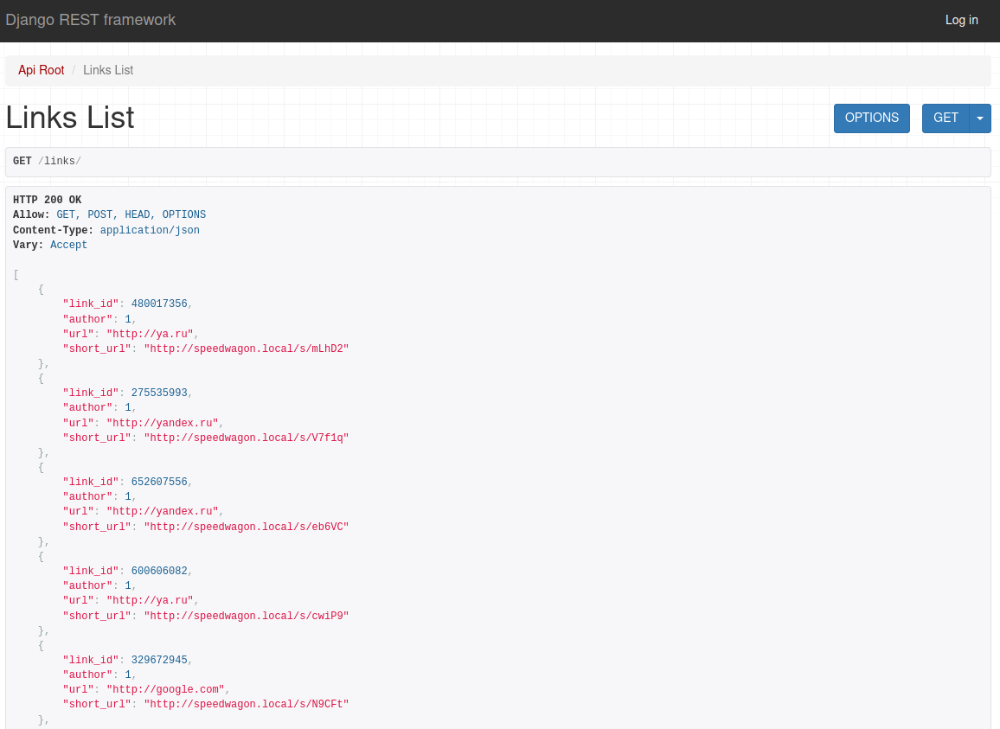
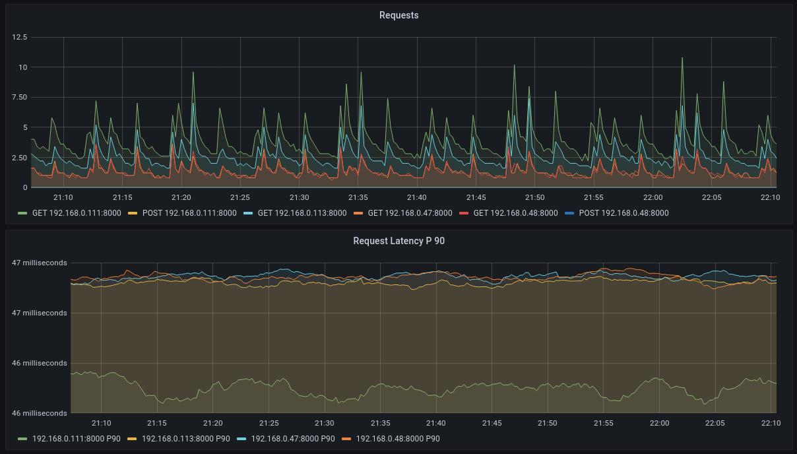
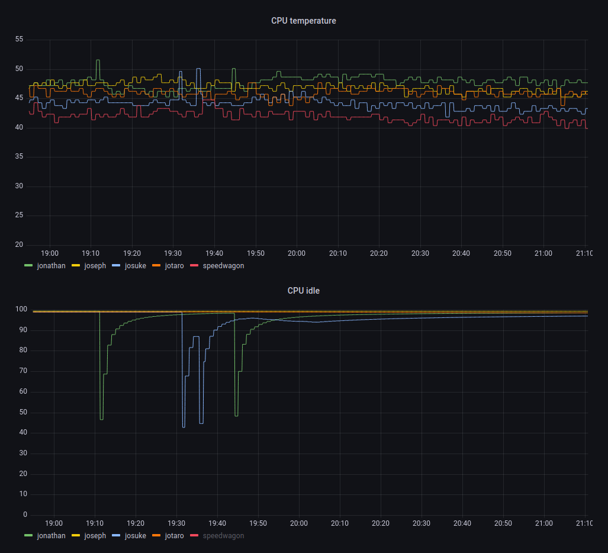
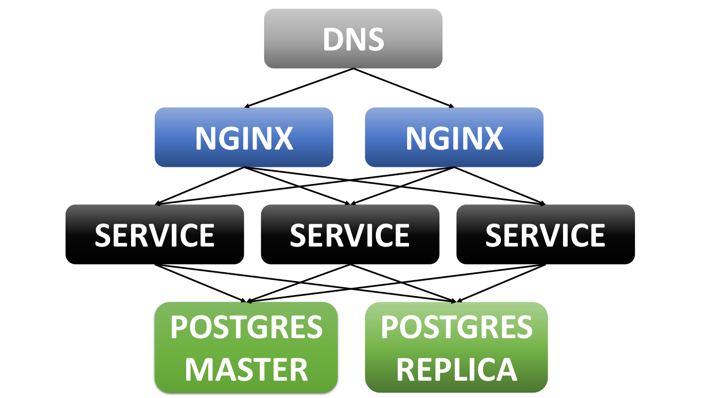

# Reliable link shortenner

## Description

Simple prototype of link shortenner service, that supposed to have high read-only availability

Functionality: you supposed to be able:
- Send a valid url with a POST request and receive a short version of this url `http://<dns>/s/<5 symbols>`
- Send a GET request on short url, to be redirected on the URL you have provided

Service must be "read-only tolerant" to one machine power-off 
(it means, that after switching off one machine you should be able to do GET requests anyway)

<details>
  <summary><strong>Some pictures</strong></summary>

  

  
  
  

</details>

⇑ ⇑ ⇑ ⇑ ⇑ ⇑ ⇑ ⇑ ⇑ ⇑ 


## Deployment 

### Machine configuration

- Copy `./machine_config/deb_requirements.sh` and `./machine_config/init.sh` on your machines
- Run `sudo ./deb_requirements.sh` on all machines (Hint: use parallel-ssh)
- Run `sudo ./init.sh -n <host_name> -u <user_name>`
- Create a password for your user

now you can do `ssh <user_name>@<host_name>.local`, because of `avahi`

- Login with new user, and install docker 
  (NB, not in script because I'm too lazy to detect, if docker already installed):
```bash
curl -fsSL https://get.docker.com -o get-docker.sh
sudo ./get-docker.sh 
```

### Database deployment

Our database is postgres master-replica DB with a single replica (not too safe, but reliable enough). 
It's a bit tricky to deploy it...

####  Master
- In `pg_hba.master.conf` change IP `192.168.0.111` on IP of your **replica** host.
- Create `.env.db` file with a content like this:
  ```
  DB_NAME=postgres
  POSTGRES_USER=postgres
  POSTGRES_PASSWORD=postgres
  DB_PORT=5432
  # Variabled below are not required: just my ideas for future
  PG_REP_USER=rep
  PG_REP_PASSWORD=rep_passwd

- Copy folder `database` on your master host
- Go to the `database` directory
- Run `sudo docker-compose up -d master`
- Connect to your database with any tool your prefer (I did with pgAdmin)
- Run a query 
`CREATE USER replicator WITH REPLICATION ENCRYPTED PASSWORD 'rep_passwd';` 
  it will create a special replication user
- Run a query 
`SELECT * FROM pg_create_physical_replication_slot('replication_slot_replica1');`
  
To ensure, that replication slot was created
- Run a query 
`SELECT * FROM pg_replication_slots;`
  
Well done, master is configured now

#### Replica

- Copy folder `database` on your replica host
- Go to the `database` directory
- Run command
`pg_basebackup -D ./replica_data -S replication_slot_replica1 -X stream -P -U replicator -Fp -R -h <master_host_name>.local`
- Enter replicator password

Now you have a backup for your database in `./replica_data` folder. It will be used by docker

- Check, that auto-config is generated : `sudo cat ./replica_data/postgresql.auto.conf`
- Run replica: `sudo docker-compose up -d replica`

It should be enough to deploy everything. If I have not forgotten something

#### After configuration

- Connect to both primary and replica
- Check that you are not able to do write-transaction on replica
- Check that changes, made on master appears on replica

### Service deployment

- Create `.env` file in `./shortenner/shortenner` directory (next to `asgi.py`) 
```
DEBUG=False
LOCAL=False
SECRET_KEY=<your_secret_key>
# Change to your DNS name (or local nginx simulating DNS :-P)
SHORT_LINK_HOST_NAME=http://speedwagon.local/s/
DB_ENGINE=django.db.backends.postgresql
DB_NAME=postgres
POSTGRES_USER=postgres
POSTGRES_PASSWORD=postgres

# todo: mDNS access from docker
# DB_HOST_MASTER=josuke.local
# DB_HOST_REPLICA=jotaro.local
DB_HOST_MASTER=<ip_of_your_master>
DB_HOST_REPLICA=<ip_of_your_replica>
DB_PORT=5432
```
- Copy `./shortenner/` directory to all your machines 
- Go to `shortenner` directory on every machine, and run `sudo docker-compose up -d`

Everything supposed to work so far. You can test it by going on `<host_name>.local:8000` 
(it will be ugly, cause have no static files).

### Nginx deployment

- In `./nginx/router.conf` change IPs from upstream to your service IPs.
- Copy `./nginx/` directory to all your machines 
- Go to `nginx` directory on every machine, and run `sudo docker-compose up -d`

Suppose to work so far. 

Now our service supposed to look like this



It's still far away from a good and reliable service, but pretty well as a start point

